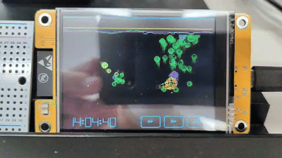

# Baiyosou (Culture Tank)

An interactive 3D living wireframe ecosystem simulation running natively on the ESP32-2432S028R (Cheap Yellow Display / CYD). 



*More demos coming soon: (Flocking Behavior / Predation / Touch Singularity)*

---

## Web Installer (One-Click Browser Flash)

Flash directly to your CYD board from your Web Browser without installing Arduino IDE or any software!

- **Web Installer Page**: [https://ootake0914-dotcom.github.io/Baiyosou/](https://ootake0914-dotcom.github.io/Baiyosou/)

*(Requires Chrome, Edge, or any browser with Web Serial API support)*

---

## Overview

**Baiyosou (Culture Tank)** transforms your ESP32 Cheap Yellow Display into a dynamic artificial life observation window. Featuring a custom 3D wireframe rendering engine, this project autonomously simulates a complete ecological food chain in real-time, including plants, herbivores, carnivores, apex predators, decomposers, and parasitic spores. 

It serves as a mesmerizing **generative art piece** and a living digital desk toy, alongside being a technical demonstration of real-time 3D vector graphics and complex system behavior on a microcontroller.

---

## Technical Highlights

- **Custom Wireframe Renderer**: High-performance 3D vector graphics with dynamic depth fading and perspective projection.
- **Fixed Time Physics**: Optimized physics loops utilizing custom fast inverse square root (`Q_rsqrt`) algorithms.
- **Flocking & Boids Algorithm**: Herbivores exhibit realistic flocking behavior (alignment, cohesion, separation).
- **Spatial Interactions**: Entities dynamically interact across a 3D coordinate space with distance-based collision and predation checks.
- **Lorentz Attractor Wind**: Chaos-based fluid dynamics and wind forces that naturally alter the ecosystem's movement patterns.

---

## Ecosystem Entities

- **Plants**: Autonomously grow and act as the base energy source.
- **Herbivores**: Exhibit flocking behavior, forage for plants, and show altruistic traits.
- **Carnivores & Apex Predators**: Actively hunt lower-tier entities.
- **Spores**: Parasitic entities that infect and disrupt the ecosystem.
- **Decomposers**: Clean up the environment and recycle energy into new plants.

---

## Touch Controls

- **Screen Tap & Hold**: Creates a gravitational singularity at your finger's position in 3D space, drawing all nearby animals and decomposers toward it. Release to scatter them (Generates a shockwave and particle explosion).

---

## Prebuilt Firmware (.bin)

Don't want to set up Arduino IDE or compile from source? You can flash the prebuilt `.bin` firmware directly!

Download the latest prebuilt binaries from [Releases](https://github.com/ootake0914-dotcom/Baiyosou/releases):

- `Baiyosou-full-4mb.bin`: Full 4MB flash image. Flash to address `0x0` using `esptool.py` or any ESP Web Flasher tool:
  ```bash
  esptool.py --chip esp32 --port COMx --baud 921600 write_flash 0x0 Baiyosou-full-4mb.bin
  ```

---

## Hardware Requirements

- **Board**: ESP32-2432S028R (Cheap Yellow Display / CYD)
- **Display**: 2.8" SPI TFT (240x320 resolution)
- **Touch**: XPT2046 Resistive Touch Controller

---

## Software & Setup

### Required Libraries
Ensure the following libraries are installed in your Arduino IDE environment:

1. **TFT_eSPI** 
2. **XPT2046_Touchscreen** 
3. **SPI** (ESP32 Built-in)

### Arduino IDE Settings
- **Board**: ESP32 Dev Module
- **Flash Size**: 4MB (32Mb)
- **Partition Scheme**: Default 4MB with spiffs or Huge APP (3MB No OTA)
- **PSRAM**: Disabled
- **Compiler Optimization**: Standard compiler optimizations are used.
- **TFT_eSPI Settings**: Ensure SPI frequency is set to **80MHz** (e.g., `#define SPI_FREQUENCY 80000000`) in `User_Setup.h` for optimal display performance.

---

## License

This project is licensed under the MIT License - feel free to customize and enjoy it on your desk!
